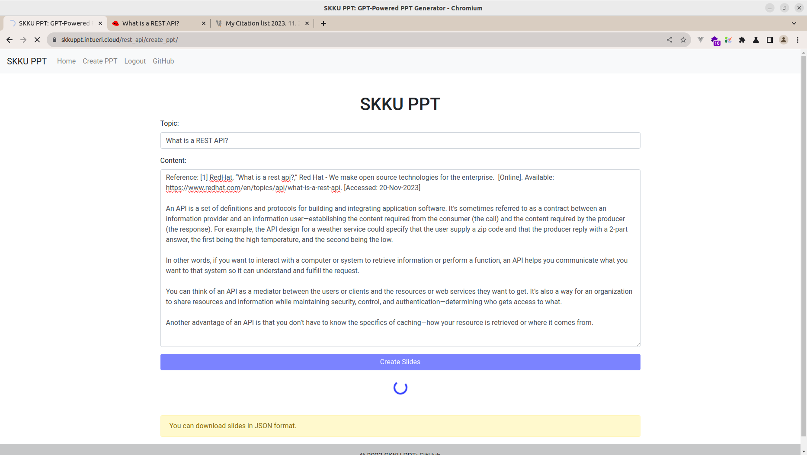

# SKKUPPT Project

## I. Introduction

SKKUPPT is a web application designed to facilitate the creation of PowerPoint presentations using the power of AI. It simplifies the design process by generating PPT structures based on user input, allowing users to focus on content rather than layout.

## II. How to Run

You can access SKKUPPT at the following URL:

- [SKKUPPT](https://skkuppt.intueri.cloud)

### Home


### Signup


To signup, fill in a unique username, and password, then confirm the password.

After signing up, you can access the login page from the Home or Navbar at the Login button.

### Login


After logging in, you can access the Create PPT page from Home or Navbar at the Create PPT button.

### Create PowerPoint Presentation (PPT)

To create a PowerPoint presentation, you'll need to navigate through a series of steps. Below are the screenshots that guide you through the creation process:

#### Step 1: Entrance Page

Here's where you start. Simply click to begin the creation of your new PPT.


#### Step 2: Create PPT

View the template options and select the one that suits your presentation style.


#### Step 3: Input Details

Enter the specifics of your presentation, such as the topic and detailed content.


#### Step 4: Generating PPT

Wait as the system processes your input and generates the slides.


#### Step 5: PPT Output

Review the generated slides and make any necessary edits.


#### Step 6: Download PPT

Once you're satisfied with the presentation, download it to your local machine.


**Filling in the PPT Creation Form:**

- **Topic**: Input the central subject of your presentation, such as "The Impact of AI on Modern Industry."
- **Details**: Provide detailed content that will be included in the PPT, like "The meaning of life is to find happiness and purpose through personal and professional endeavors."

## III. How to Deploy in Production Level

### 1. Set .env

1.1 Copy the template:

```
cp .env.template .env
```

1.2 Fill in the content (do not include '<' and '>'):
Here's the .env.template for reference:

```
VIRTUAL_HOST=<virtual_host_name>
LETSENCRYPT_HOST=<https_address>
LETSENCRYPT_EMAIL=<https_email>
DEFAULT_EMAIL=<default_email>
BACKEND_HOST=backend
BACKEND_PORT=8000
FRONTEND_HOST=frontend
FRONTEND_PORT=8080
OPENAI_API_KEY=<api_key>
DJANGO_SECRET_KEY=<django_secret_key>
DJANGO_DEBUG=False
DB_HOST=db
DB_PORT=3306
DB_ROOT_PASSWORD=<db_root_password>
DB_DATABASE=<db_name>
DB_USER=<user_name>
DB_PASSWORD=<user_password>
IS_PROD=True
```

1.3 Use the Makefile:
To use this Makefile, save it in the same directory as your `docker-compose.yml`.

Usage examples:

- To see the usage instructions:

```
make help
```

- To build all services:

```
make build service=all
```

- To build a specific service (e.g., `db`):

```
make build service=db
```

- To bring up all services:

```
make up service=all
```

- To bring up a specific service (e.g., `frontend`):

```
make up service=frontend
```

- To bring down all services:

```
make down service=all
```

- To bring down a specific service (e.g., `backend`):

```
make down service=backend
```

## IV. How to Develop

### 1. Create Virtual Dev Environment

Navigate to the desired directory (`frontend` or `backend`) and set up a virtual environment:

```
cd <frontend|backend>
virtualenv venv
source venv/bin/activate
pip3 install -r requirements.txt
```

### 2. Add Environment Variable at the End of Each Activation Script

Example for adding an environment variable:

```
echo ENV_VAR_NAME='value' >> <backend|frontend>/venv/bin/activate
```

#### 2.1 Backend Environment Variables

```
BACKEND_HOST=localhost
BACKEND_PORT=8000
FRONTEND_HOST=localhost
FRONTEND_PORT=8080
OPENAI_API_KEY=<fill>
```

#### 2.2 Frontend Environment Variables

```
BACKEND_HOST=localhost
BACKEND_PORT=8000
FRONTEND_HOST=localhost
FRONTEND_PORT=8080
DJANGO_SECRET_KEY=<fill>
DJANGO_DEBUG=True
DB_HOST=localhost
DB_PORT=3306
DB_ROOT_PASSWORD=<fill_localdb>
DB_DATABASE=skkuppt_db
DB_USER=skkuppt_user
DB_PASSWORD=<fill>
IS_PROD=False
```

### 3. Development

#### 3.1 DB

3.1.1 Migration

```
cd frontend
python3 manage.py makemigrations
python3 manage.py migrate
```

3.1.2 MariaDB Client

- CLI:

```
mariadb -h 127.0.0.1 -P 3306 -u root -p
```

- Dump into SQL:

```
mysqldump -h 127.0.0.1 -u <user_name> -p --no-data <dbname> > ddl.sql
```

#### 3.2 Run

Dev
3.2.1 Frontend

```
cd frontend
source venv/bin/activate
gunicorn --bind localhost:8080 config.wsgi:application
```

3.2.2 Backend

```
cd backend
source venv/bin/activate
uvicorn
```

## V. Architectures

...

### 2. Database (DB) Architectures

Below are the Entity-Relationship (ER) diagrams that depict different aspects of the database architecture:

- **User Authentication ER Diagram**: This diagram illustrates the database structure that supports user authentication, including tables for users, roles, and permissions.
  

- **Session ER Diagram**: Details the session management handled by the database, showcasing the session table and its relationships.
  

- **Migration ER Diagram**: Demonstrates the migration history and schema changes over time in the database, providing a visual representation of the migration process.
  
